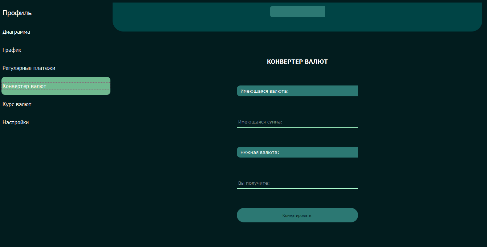
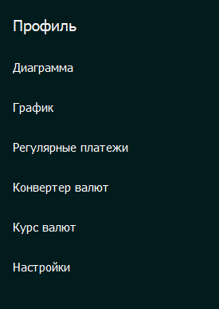

# Пояснительная записка

Классы:

• EntrancePage - класс отвечающий за объект QWidget, содержащий страницы входа и регистрации.

• MainPage - класс, отвечающий за объект QWidget, содержащий основные страницы(Профиль, Настройки, Диаграмма, График,
Регулярные платежи, Курс валют, Конвертер валют).

Функции:

• show_or_hide_existing_password, show_or_hide_created_password, show_or_hide_repeated_password - эти функции показывают
или скрывают пароль при вводе на страницах входа и регистрации, если пользователь нажал на соответствующий QCheckBox
объект. Функций 3, так как они отвеают за разные QLineEdit объекты.

• go_to_register_page - отвечает за переход на страницк регистрации со страницы входа, при нажатии на кнопку
QPushButton "Регистрация".

• go_back_to_sign_in_page - отвечает за переход со страницы регистрации обратно на страницу входа при нажатии на кнопку
QPushButton.

• go_main_page - отвечает за переход из формы входа или регистрации на основную форму(класс MainPage). Фукция вызывается
при нажатии на кнопку "Войти" или "Зарегистрироваться" и проверяет значения функций для проверки введенных паролей и
электронных почт. Если все значения удовлетворяют условиям, осуществляется переход на основную форму.

Также, функция проверяет объект QCheckBox "Запомнить меня" на странице входа, которая запоминает данные для входа в
аккаунт. Создается файл 'remember_me_file.txt', куда записывается "False", если пользователь не выбрал пункт "Запомнить
меня". Если же пункт выбран, в файл записывается "True", email и пароль для запоминания в одну строку через
знак-разделитель ";".

• check_data_sign_in_page - сверяет введенные данные на странице входа с уже существующими в базе данных.

• check_data_sign_up_page - проверяет введенные данные на странице регистрации в соответствии с заданными валидаторами
формата пароля и электронной почты. Выводит описание ошибки, если данные некорректны.

• check_email_correctness - проверяет корректность введенного адреса электронной почты(проверка на наличие "@" и ".").

• go_sign_in_page_from_main_page - отвечает за выход из аккаунта при нажатии на кнопку QPushButton "Выйти из аккаунта".
Закрывает окно основной формы и открывает окно формы авторизации в системе.

• change_page - отвечает за смену страниц в окне основной форме. При выборе пункта открывается соответствующая страница.

• convert_money - конвертирует валюту при нажатии на кнопку "Конвертировать" на странице конвертера валют.

• show_exchange_rates - показывает курс валют на выбранную дату в таблице на соответствующей странице при нажатии на
кнопку "Показать".
